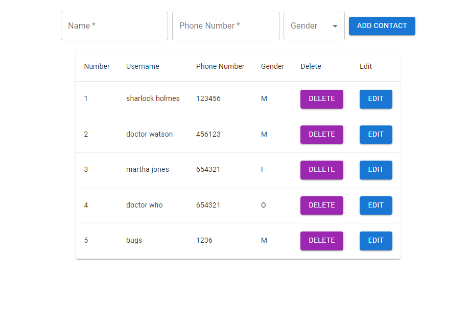

# Contact Manager App

## Outcome 

## Introduction

The Contact Manager App is a simple web application built using React, Material UI and Axios for managing contacts. It allows users to add, edit, and delete contact information such as name, phone number, and gender. This README provides an overview of the application, its features, and instructions for running and deploying it.

## Features

- **Add Contacts:** Users can add new contacts by providing a name, phone number, and gender.

- **Edit Contacts:** Contacts can be edited by clicking the "Edit" button, which populates the input fields with the contact's information. After making changes, users can click the "Update" button to save their edits.

- **Delete Contacts:** Contacts can be deleted by clicking the "Delete" button, which removes the contact from the list.

- **View Contact List:** The application displays a list of contacts in a table format, including their name, phone number, and gender.

- Check Out the page: https://contact-app1-cb433.web.app